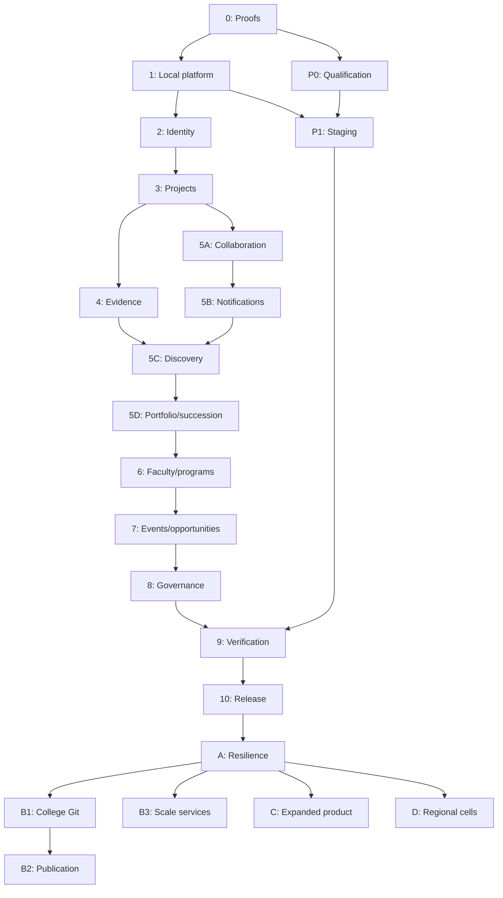

# PeerGit implementation phases

Deliver an economical GitHub-only campus launch, then add college-controlled Git while preserving project identity, evidence history, and authorization. Schedule by dependencies and measured gates, not historical dates. All checklists below are planned work; existing progress is not certified without evidence.

## Authority and audit

Precedence: current user decisions → [plan-new.md](plan-new.md) for launch → [plan-future-scale.md](plan-future-scale.md) for later capabilities/gates → [plan.md](plan.md) for retained rationale, correctness, and traceability. Use these actual files rather than obsolete filenames inside source excerpts. Phase 0 confirms staffing and operating ownership; inadequate funding moves dates or requires an explicit scope decision, never silent removal of controls.

Launch targets 5,000 registered users, with a 6,000-account test buffer. One-hour RPO and four-hour RTO remain targets until demonstrated on intended hosting.

| Audit finding | Resolution |
|---|---|
| Original requires native Git at launch | Superseded: GitHub-only launch; college hosting/publication in B1/B2. |
| Redis/NATS and heavier original baseline | PostgreSQL initially owns sessions, jobs, outbox, search, notifications, summaries. |
| Capacity/recovery assumptions differ | 5,000 users, 6,000-account test buffer, one-hour RPO/four-hour RTO. |
| Unconsumed outbox events marked published | Complete delivery only after durable downstream work is recorded; unavailable consumers leave work pending. |
| Claims lack abandonment recovery | Expiring leases, stale-worker fencing, retry/operator repair, crash tests. |
| Security/MFA/monitoring/recovery too late | Build controls with workflows; Phase 9 independently verifies them. |
| MVP boundaries disagree | Student collaboration is internal; campus release requires Phases 6–10 and production gates. |
| Temporary test UI considered sufficient | Usable screens, errors, keyboard access, responsive layouts per phase. |
| Binding health conflated with current provider | Separate current-binding selection from health; stale access cannot create competing current bindings. |
| Installation/binding tenant checks missing | Tenant-safe constraints and acting-user/project/grant authorization tests. |
| Schema excerpts omit workflows | Explicit migration checklists for invitations, idempotency, leases, consent, contexts, and other required tables. |
| Lifecycle differs from schema | draft, active, on_hold, completed, archived; recruiting derives from open roles. |
| Generic S3 retention assumptions for R2 | Immutable generations, supported locks, independent copies, actual-provider tests. |
| Future phases/source links missing | Stages A–D, dedicated college Git, actual source files. |

PostgreSQL 18 supports native UUIDv7; retain the new baseline. [PostgreSQL UUID documentation](https://www.postgresql.org/docs/18/functions-uuid.html)

GitHub does not automatically redeliver failed webhooks: durable ingestion and scheduled reconciliation are required. [GitHub failed deliveries](https://docs.github.com/en/webhooks/using-webhooks/handling-failed-webhook-deliveries)

R2 lacks S3 bucket versioning/Object Lock APIs. Configure its own bucket locks separately, test retention/deletion interactions, and retain independent copies; do not claim protection against all privileged policy changes. [R2 compatibility](https://developers.cloudflare.com/r2/api/s3/api/), [bucket locks](https://developers.cloudflare.com/r2/buckets/bucket-locks/)

## Environment separation

| Environment | Application runtime | Services/data |
|---|---|---|
| Local | Go API/worker and Next.js on host | Docker PostgreSQL 18, local S3-compatible storage, email capture, Caddy same-origin HTTPS, safe fixtures. |
| Staging | Production-shaped immutable containers | Separate database/buckets/secrets/test GitHub App; synthetic data. |
| Production | Caddy/Next.js/API/worker/PostgreSQL on qualified host | Approved object/email providers, encrypted storage, independent backups, external monitoring, funded support. |
| Future college-Git development | Existing local stack plus optional Git profile | Forgejo/Git fixtures added at B1. |

Local startup requires no Redis, NATS, Forgejo, OpenSearch, ClickHouse, or monitoring cluster. Separate development/staging/production configuration; prohibit production-data copies into lower environments. Document host commands separately from Docker service commands. Production cannot inherit development credentials, bind mounts, debug flags, or email capture.

Baseline: Go 1.27.x, Next.js 16.3.x/React 19/TypeScript, Node 24 LTS, PostgreSQL 18.x; confirm supported patches during implementation. Extend the existing root Go skeleton rather than relocating it into speculative scaffolding.

## Foundation contracts

Build contracts with their first owning workflow, starting in Phases 1–4:

- Stable project/logical repository/submission/contribution IDs; bindings can change without losing identity/history.
- Repository bindings separate from projects, installation grants, and normalized evidence. One current pointer independent of active/stale/permission_lost health. Revocation denies access while preserving history.
- Provider-neutral repository/evidence responses with capabilities, provenance, freshness/health. Only GitHub adapter at launch.
- Canonical Git identity separate from observations: commits use `git:<hash-algorithm>:<oid>`; provider objects use immutable repository-qualified keys. Verified attribution never implies commit counts prove contribution.
- Immutable snapshots with real academic/event FKs; exact SHA, server receipt, deadline eligibility, capture state, stored-byte verification are separate facts.
- Transactional outbox event ID/type/version/tenant/aggregate identity and version/time/minimal payload. Domain/outbox commit atomically. Durable handler jobs/inbox rows and delivery receipts precede completion; unknown events pending or visibly failed with alerts.
- PostgreSQL bounded jobs/deduplication/expiring leases/attempt fencing/retries/backoff/jitter/deadlines/dead-letter/operator repair. Claim briefly then external work outside transaction. Conditional completion prevents stale overwrites; immutable keys/idempotent external operations also protect requests already in flight.
- Central current authorization, tenant-safe constraints, audit/revocation for delayed work/SSE/export/download. Never trust request tenant alone.
- Small GitHub/object/email adapters, direct calls and SQL transactions internally. No provider factory, broker framework, future directories, native tables, or clusters before needed; later additive migrations.

Bound request bodies, uploads/archive size, capture concurrency, webhook payloads, per-user SSE, login attempts, search/contact complexity, and exports/reconciliation. Return `429` with retry guidance rather than starving ordinary requests.

HTTP idempotency differs from job deduplication: scope key by actor/tenant/operation, compare request hash, replay safe recorded response or conflict. No event-ID high-water mark that skips late-committing outbox transactions.

## Dependencies and milestones

Arrows are prerequisites, not dates. Phase 4/5A may run in parallel. P0 starts alongside Phase 1; P1 starts with deployable increments and continues through release. B1/B2 never depend on B3. Stage A need not adopt Redis/brokers to qualify college Git. C/D do not require every optional earlier feature.

| Milestone | Required gates | Meaning |
|---|---|---|
| Risk proof | 0/P0 prerequisites | Provider/staffing/funding understood. |
| Durable foundation | 1–2 | Local stack/identity/isolation/durable recovery. |
| Team/evidence | 3–4 | Recruitment/exact immutable evidence. |
| Student collaboration | 1–4 and 5A–5D | Internal milestone, not campus approval. |
| Campus feature contract | 6–8 plus earlier gates | All launch personas complete. |
| Release candidate | P0/P1/9 | Artifacts/policy/capacity/recovery accepted. |
| Campus release | 10 | Observed approved expansion. |
| College Git/publication | B1/B2 | Qualified native hosting/verified authority switch. |

Each phase below has purpose, source references, dependencies, checklist, migrations/interfaces, usable UI, validation, completion gate, and deferred work. Gates require recorded passing evidence.

## Phase 0 — Contract and risk proofs

**Purpose:** Lock executable acceptance and feasible capacity before promising dates.

**Source references:** [Launch](plan-new.md) §§1–3, 6, 9, 14–16, 19–21; [future](plan-future-scale.md) §§1–3, 11; [original](plan.md) C4/C15/recovery.

**Dependencies:** None; inspect existing API/graph before extension.

**Checklist:**
- [x] Personas/precedence/exclusions/toolchain/staffing/support owners/budget/stop conditions — [contract](../docs/verification/contract.md) reviewed and accepted by Ashok on 2026-10-02.
- [x] Prove GitHub App private access/revocation independently of linked identity — selected/excluded, repository removal, suspension and uninstall/reinstall passed in [results](../docs/verification/results.md).
- [x] Exact-SHA GitHub archive capture after branch movement and local stored-byte reread/hash — [results](../docs/verification/results.md). Actual production-provider retention is a P1 gate.
- [x] PostgreSQL duplicate/lease expiry/fencing/crash proofs — local evidence in [results](../docs/verification/results.md); production migrations remain Phase 1.
- [x] Define maximum bytes/timeouts/quotas/ten-capture concurrency/LFS/submodule behavior/growth limits — [contract](../docs/verification/contract.md), ten local 100 MiB captures verified; production load remains Phase 9.

**Migrations/interfaces:** Minimal executable transaction/provider/storage proofs; carry findings into 1/4; SQL excerpts are not complete migrations.

**Usable UI:** Acceptance walkthroughs for onboarding/application/repository/pending-verified-failed receipts; label prototypes, replace with working screens later.

**Validation:** Execute GitHub authorization, local S3 storage/corruption and PostgreSQL queue crash experiments; record commands/results/limits/owners. Production-provider retention waits for P1.

**Completion gate:** GitHub App access/revocation, exact-SHA capture, local storage integrity, queue recovery and owner review pass. **Complete for the local development scope on 2026-10-02:** all required gates passed in `go run ./cmd/verify all --target local`, and Ashok accepted the contract. Cloudflare R2 is not part of Phase 0 by current decision; actual selected production-provider retention/deletion must pass in P1. Setup: [phase0-requirements.md](phase0-requirements.md).

**Deferred work:** Native Git, rollout, speculative infrastructure.

## Phase 1 — Local foundation and durable platform

**Purpose:** Extend existing skeleton into recoverable local platform/deployable increments.

**Source references:** [Launch](plan-new.md) §§5–8, 10–14; [future](plan-future-scale.md) §1.

**Dependencies:** Phase 0; P0 alongside.

**Checklist:**
- [x] Host Next.js/worker; Docker PostgreSQL/storage/email/Caddy; startup/shutdown/fixtures.
- [x] Dedicated ordered migration command, never app startup; pooling/timeouts/readiness/shutdown.
- [x] API envelopes/errors/request IDs/cursors/optimistic versions/config validation/OpenAPI/idempotency.
- [x] Atomic jobs/outbox/audit, bounded claims/leases/fencing/retries/operator repair.
- [x] Redacted logs/lightweight metrics/alerts/CI/backup hooks now.

**Migrations/interfaces:** History, job lease expiry/attempt/deadline/deduplication, event envelope/per-handler durable delivery, audit, HTTP request hash/result/expiry; native UUIDv7. Unknown handlers cannot mark read events delivered.

**Usable UI:** Accessible responsive shell/forms/loading/empty/error/service unavailable/request-ID support; restricted operator CLI initially.

**Validation:** Passed local Compose configuration/startup; dedicated migrations ran blank-to-head and repeat; uncached PostgreSQL integration tests covered transactional enqueue rollback, request-response replay/expiry, job deduplication, concurrent claims, expired deadlines, lease recovery/stale completion, outbox retry/operator repair, and append-only audit. `go test ./... -count=1`, `go vet ./...`, `staticcheck ./...`, Next typecheck/build, dependency audit, desktop/mobile Playwright checks, API/Caddy route checks, and PowerShell backup-script parsing passed. CI workflow is added; hosted CI has not run in this turn.

**Completion gate:** Local Phase 1 implementation and acceptance checks passed on 2026-10-02. Startup is reproducible, migrations are isolated from application startup, durable queues recover/fence abandoned work, and operator alerts/repair steps are documented.

**Deferred work:** Redis/NATS/native tables/search/monitoring clusters/service extraction.

## Phase 2 — Identity, campus, authorization, and media

**Purpose:** Establish identity/tenant boundaries before private/privileged workflows.

**Source references:** [Launch](plan-new.md) §§3.13, 4.1, 8, 11–12, 14; [original](plan.md) C1/C2/C9/C14.

**Dependencies:** Phase 1.

**Checklist:**
- [x] Verified Google OIDC/campus policy/invitations/orgs/profiles/skills/consent; invited externals same verified flow.
- [x] Opaque sessions/keyed hashes/host-only Secure HttpOnly SameSite cookies/CSRF/origin/logout/suspension.
- [x] Privileged MFA/shorter sessions/fresh auth/audited roles/rate limits before privileged administration.
- [ ] Authorized upload intents/limits/type validation/quarantine/scanning/clean publication; direct PNG/JPEG uploads are currently size-limited and decoded/re-encoded, but a separate upload-intent and malware-scanning workflow is not implemented.

**Migrations/interfaces:** Users/identities/sessions/colleges/domains/orgs/memberships/roles/invitation expiry-acceptance-revocation/profiles/skills/consent/upload states/reports. Tenant keys; media metadata required by state, not before upload.

**Usable UI:** Login/onboarding/invites/profile/consent/admin/MFA/upload progress/quarantine/errors; keyboard labels/responsiveness.

**Validation:** Passed locally on 2026-10-02: PostgreSQL blank-to-head/repeat migrations; fake-provider OIDC state/nonce/verified-email/S256-PKCE/external-invitation acceptance/replay; session, consent, profile, audited role grant, MFA denial, suspension/session revocation, cross-tenant constraints, private-media denial; Go unit/integration/vet/staticcheck; Next typecheck/build and responsive browser walkthroughs. Production Google registration and trusted-proxy client-IP configuration remain deployment gates. Antivirus scanning is not claimed; accepted raster images are decoded and re-encoded before publication.

**Completion gate:** Identity/admin/consent and tenant-isolation gates pass locally. Phase 2 remains open until an approved upload-intent/scanning policy is implemented and campus-admin promotion has a reviewed workflow; first-admin setup remains documented as an operator bootstrap.

**Deferred work:** Other IdPs/SAML/arbitrary external signup. Unreviewed uploads and self-service campus-admin promotion remain blocked as described above.

## Phase 3 — Projects, teams, and recruitment

**Purpose:** Deliver student/lead journeys with safe ownership.

**Source references:** [Launch](plan-new.md) §§3.1–3.3, 3.9, 4.2, 4.5–4.6, 8; [original](plan.md) C3/C5/C9.

**Dependencies:** Phase 2.

**Checklist:**
- [x] Projects/visibility/skills/owners/members/open roles/applications/explicit invite acceptance.
- [x] Lifecycle draft/active/on_hold/completed/archived; recruiting derives from open roles.
- [x] pending → accepted/rejected/withdrawn; atomic permission/capacity/state/version/membership/outbox acceptance.
- [x] SQL locks/constraints preserve last-slot/duplicate/remaining-owner invariants; audit.

**Migrations/interfaces:** Project states/visibility/skills/owners/members/roles/capacity/applications/decisions/invitations/tenant constraints/events/conflict responses.

**Usable UI:** Create/tabs/team/roles/discovery/application decisions/invites/visibility/lifecycle; closed/full/conflict states.

**Validation:** Create/apply/withdraw/accept/reject/invite; capacity/duplicate races/removed lead/last owner/tenant negatives.

**Completion gate:** Usable journeys and concurrent membership/capacity/ownership checks pass. The implementation checklist is complete; the local PostgreSQL integration and browser journeys remain to be run on a live stack before this gate is signed off. Follow [the local run guide](peergit-run.md).

**Deferred work:** Original offer timeout/general DMs/auto-matching/cross-campus.

## Phase 4 — GitHub evidence and immutable snapshots

**Purpose:** Authorized evidence with stable repository/submission identity.

**Source references:** [Launch](plan-new.md) §§4.3–4.5, 8.5, 9, 15–16; [future](plan-future-scale.md) §§1, 11, 13; [original](plan.md) C4b/C15/publication correctness.

**Dependencies:** Phase 3 and Phase 0 provider/storage proofs.

**Checklist:**
- [ ] Verified identity links separate from installation grants; short-lived tokens on demand, never persisted.
- [ ] Stable repositories/immutable-ID bindings; tenant-safe installations and acting-user/project/grant permission. Rename/transfer changes display metadata only.
- [ ] Raw HMAC before parse; durable webhook inbox before acknowledgment within ten seconds; deduplication/rate-aware scheduled reconciliation.
- [ ] Canonical contributions/observations/freshness/health/current permissions; revoked/stale bindings cannot create competing current bindings.
- [ ] Resolve exact SHA before server receipt/capture-job transaction; deadline eligibility separate from capture; retries same SHA.
- [ ] Bounded downloads/no extraction or execution/immutable keys/reread hash/current-scope downloads/LFS-submodule-provider disclosures.

**Migrations/interfaces:** Identity links/tenant installations-grants/repositories-current pointer/bindings-health/webhook inbox-cursors/contributions-observations-stats/receipts-snapshots-attempts-object manifests. Composite tenant/repository FKs; one current binding independent of health. Minimal typed academic/event parent contexts and submission-snapshot FKs now; 6/7 extend them, no unvalidated generic context IDs.

**Usable UI:** Connect/install/select repo, activity/contributions/freshness/stale-revoked warnings, ref/SHA receipt/progress/retry/download/disclosures.

**Validation:** Tenant/grant negatives; rename/transfer/uninstall/revocation/outage/rate/lost-duplicate-out-of-order webhook tests. Replay 100 commits stays 100, then 30 new reaches 130. SHA race/force-push after receipt/duplicate submission/interruption/oversize/corruption/retry/stale worker/deadline/revoked download.

**Completion gate:** Provider/replay failures safe; exact identity/stored bytes verified; delayed capture never invalidates on-time receipt.

**Deferred work:** Native Git/GitHub writes/SSH-LFS hosting/bidirectional issues/scoring/source indexing.

## Phase 5A — Daily collaboration

**Purpose:** Usable daily team coordination.

**Source references:** [Launch](plan-new.md) §§3.14, 4.5, 7–8; [original](plan.md) C10/C11/C13.

**Dependencies:** Phase 3; parallel with Phase 4 permitted.

**Checklist:**
- [ ] Updates/comments/reactions/tasks/milestones/discussions/follows/bookmarks.
- [ ] Current visibility/membership/edit rules/limits/report-spam hooks/atomic notification events.

**Migrations/interfaces:** Updates/comments/reactions/tasks-assignees-milestones/threads-replies/follows-bookmarks; unique tenant constraints/edit versions.

**Usable UI:** Updates, keyboard task board with list alternative, milestones/discussions/follow-bookmark/empty-conflict-errors.

**Validation:** Create/edit/complete/duplicates/concurrent edits/visibility-removal/sanitized rendering/keyboard task movement.

**Completion gate:** Teams coordinate without leaks or lost conflicting edits.

**Deferred work:** Collaborative editors/stories/issue mirroring.

## Phase 5B — Durable notifications

**Purpose:** Reliably surface events without another realtime service.

**Source references:** [Launch](plan-new.md) §§10.3–10.4, 11, 14; [original](plan.md) C7.

**Dependencies:** Phase 5A and Phase 1 outbox/jobs.

**Checklist:**
- [ ] Durable inbox/preferences/important email/bounded SSE heartbeat-caps-reconnect-Last-Event-ID replay.
- [ ] Durable inbox/email work before event completion; idempotent retries, separate email delivery semantics.
- [ ] Reauthorize live/replay after session/membership changes; inbox authoritative offline.

**Migrations/interfaces:** Inbox/read markers/preferences/delivery attempts-provider IDs/replay retention/handler deduplication; no private source in email.

**Usable UI:** Inbox/read controls/preferences/reconnect status/email settings.

**Validation:** Crash between inbox insert/event completion/duplicate/email outage/reconnect-replay/session expiry-revocation/caps-backlog.

**Completion gate:** Failures do not lose notifications or bypass replay permissions.

**Deferred work:** Presence/typing/push/realtime gateway.

## Phase 5C — Scoped messaging and discovery

**Purpose:** Connect people/projects through authorized SQL paths.

**Source references:** [Launch](plan-new.md) §§2.4–2.5, 3.14, 4.6, 10, 15; [original](plan.md) C6/C8.

**Dependencies:** Phase 4 and Phase 5B.

**Checklist:**
- [ ] Project/application-context messaging/participants/block-report; explicit types for later scoped mentor/contact grants.
- [ ] Query-based feeds/current follows-visibility/stable cursors; PostgreSQL FTS/trigram search with visibility in query.
- [ ] Weekly Active Collaborative Projects (WACP) source definition/reproducible SQL summaries/window semantics; descriptive, not scoring.

**Migrations/interfaces:** Typed conversations/participants/messages/blocking/search indexes/needed summaries and rebuilds; no feed fan-out or analytics authorization store.

**Usable UI:** Scoped messages/report-block/feed/search-filters/no-results/descriptive summaries/freshness/errors.

**Validation:** Context guessing/removed participants/visibility; pagination/summary replay/metric fixtures/search p95 <500 ms at representative cardinality.

**Completion gate:** Coordination/discovery meet permissions/consistency/latency without deferred services.

**Deferred work:** General DMs/ML/presence/fan-out/OpenSearch/individual leaderboards.

## Phase 5D — Portfolios and succession

**Purpose:** Share verified work and preserve ownership at graduation.

**Source references:** [Launch](plan-new.md) §§3.2, 3.9, 3.14, 4.6, 11; [original](plan.md) A2/A13.

**Dependencies:** Phase 5C.

**Checklist:**
- [ ] Consented portfolios/selected evidence/revocable links/accessible print; current consent/visibility at render/download.
- [ ] Project/org handover/fresh auth/eligible successor acceptance/atomic owner change/audit/provider reconciliation.

**Migrations/interfaces:** Portfolio selections-consent/share grants-expiry-revocation/export jobs/transfers-acceptance-audit; no private evidence in public caches.

**Usable UI:** Preview/share/revoke/print/handover proposal-acceptance-eligibility-conflict.

**Validation:** Revoked consent-links/private evidence/cached exports/print accessibility/concurrent handover/last owner/provider failure.

**Completion gate:** Phases 1–4 and 5A–5D pass internal student collaboration, not campus release.

**Deferred work:** Rich resumes/bulk graduation campaigns/credentials.

## Phase 6 — Faculty, mentorship, academic contexts, and programs

**Purpose:** Complete minimum launch faculty/mentor/innovation-cell workflows.

**Source references:** [Launch](plan-new.md) §§3.4, 3.6, 3.10, 3.14, 4.4, 11; [original](plan.md) A3/A4/F2/F8.

**Dependencies:** Phase 5D and Phase 4 academic foundations.

**Checklist:**
- [ ] Faculty/mentor verification/research openings/endorsements/mentorship requests-capacity-lifecycle/revocation.
- [ ] Typed courses/terms/cohorts/assignments/submissions/evaluator scope for PBL reports/snapshot linkage.
- [ ] Program calls/applications/reviewers/cohorts/milestones/outcomes/digests/CSV; accepted mentors scoped without forced campus membership.

**Migrations/interfaces:** Verification/capacity/engagement/access grants/openings/endorsements/academic relations/calls-reviews-cohorts-outcomes/export jobs; typed tenant FKs/reviewer conflict rules.

**Usable UI:** Faculty supervision/PBL/endorsement, mentor capacity/request, research opening, program call/review/cohort/outcome/digest/CSV.

**Validation:** Persona journeys/concurrent capacity/revoked external scope/academic tenant-context mismatches/reviewer conflicts/CSV privacy-injection/delayed capture.

**Completion gate:** All three journeys pass capacity, academic linkage and revocation.

**Deferred work:** Auto-matching/scheduling/grading/complex funding/full research data-citations.

## Phase 7 — Basic events and governed opportunities

**Purpose:** Organizers/recruiters with trustworthy deadlines and contact consent.

**Source references:** [Launch](plan-new.md) §§3.5, 3.7, 3.9, 3.14, 4.4, 11; [original](plan.md) C12/A10/A11.

**Dependencies:** Phase 6 and Phase 4 event foundations.

**Checklist:**
- [ ] Basic event setup/types/registration-waitlist/teams/deadlines/immutable submissions/basic results/exports.
- [ ] Deadline receipt independent of verification; delayed capture cannot make on-time receipt late, failed capture visible under policy.
- [ ] Approved external orgs/opportunities/student opt-in search/scoped contact acceptance/blocking/audit; acceptance never unrestricted messaging.

**Migrations/interfaces:** Events/organizers/registration-waitlist-teams/deadline versions/typed submissions/results; external approvals/opportunities/opt-in/contact/access grants. Atomic capacity/eligibility.

**Usable UI:** Organizer setup/registration/team/submission/results; opportunity approval/listing/student discoverability-contact/recruiter scoped search-status.

**Validation:** Organizer/club/recruiter journeys/slot-waitlist-team-deadline races/delayed capture/tenant/opt-out/block/revocation/no bulk-export-DM bypass.

**Completion gate:** No oversubscription or consent/deadline bypass; journeys pass.

**Deferred work:** Advanced judging/runners/payments/broad marketplace/recruiter DMs-bulk personal export.

## Phase 8 — Governance and institutional completion

**Purpose:** Complete institutional/operator workflows around earlier controls.

**Source references:** [Launch](plan-new.md) §§3.8, 3.11–3.14, 11, 14, 16, 19; [original](plan.md) C14/A5/A15/F5.

**Dependencies:** Phase 7; reporting/block/suspension/audit primitives already accompany features.

**Checklist:**
- [ ] Moderation/appeals/restricted support/privacy export-deletion-retention/incidents.
- [ ] Placement/admin aggregates/exports/small-group suppression/consented showcases/governed sharing.
- [ ] Consent/deletion through caches/summaries/exports/media/snapshots/backups under policy; deletion ledger for restores.
- [ ] Operator reason/expiry/minimum scope/audit/review/escalation; policy readiness without blanket consent.

**Migrations/interfaces:** Cases/actions/appeals/support grants/privacy requests-deletion ledger-retention execution/institutional export-share grants/showcase consent/suppression.

**Usable UI:** Moderator/appeals/operator/privacy status/admin-placement aggregates/export approval/showcase consent-revocation/sharing.

**Validation:** All personas/audited privilege/appeals/consent-deletion/small-group inference/exports/deletion replay after restore.

**Completion gate:** Campus feature contract complete; release still requires P0/P1/9.

**Deferred work:** Rich accreditation/leaderboards/anomaly models/ungoverned showcases/unrestricted impersonation.

## Production track P0 — Qualification and prerequisites

**Purpose:** Resolve operating/provider/funding risks during local implementation.

**Source references:** [Launch](plan-new.md) §§5–6, 11, 14–16, 19–20; [future](plan-future-scale.md) §§14, 16–18.

**Dependencies:** Phase 0; alongside Phase 1, not final hardening.

**Checklist:**
- [ ] Actual host CPU/RAM/disk/architecture/account allocation/funded paid fallback; no assumed free capacity.
- [ ] Domain/TLS/GitHub-Google registration/email approval/object residency-retention/independent backups/external monitoring/contacts.
- [ ] Compute/storage-growth/backups/email/egress/limits/staffing cost worksheet/admission budget/stop owners.

**Migrations/interfaces:** Separate secrets/config/provider approvals/recovery manifests; actual residency not location hints; no repository secrets.

**Usable UI:** Readiness/runbooks and accurate support/policy information with shipped screens.

**Validation:** Provider/domain/email smoke/host-budget review/retention-access/external alerts/owners.

**Completion gate:** Capacity/funding/approvals/ownership confirmed.

**Deferred work:** HA/multi-region/unverified free-tier promises.

## Production track P1 — Staging and repeatable release

**Purpose:** Reproducible artifacts promoted without rebuilding.

**Source references:** [Launch](plan-new.md) §§13–14, 16; [future](plan-future-scale.md) §1.

**Dependencies:** Phase 1 increments/P0 staging prerequisites; continues alongside features.

**Checklist:**
- [ ] Immutable multi-architecture images/pinned inputs/scans/SBOM/digests/verify used architectures.
- [ ] Isolated staging/synthetic data/test Apps/secrets/resource limits/TLS-origin-session-health smoke.
- [ ] Dedicated migration rehearsals/expand-contract/app rollback/restore for non-reversible migrations/maintenance windows.
- [ ] Hourly recovery points and nightly full backups/independent copies/paired DB-object manifests/clean-host restore/secrets-config/deletion replay. Test the selected production object's actual retention and deletion policy before launch.

**Migrations/interfaces:** Separate deployments/manifests/compatibility-rollback notes/backup schedules; immutable object generations, provider-supported retention controls and independent copies. If R2 is selected later, use its bucket locks without assuming S3 versioning/Object Lock.

**Usable UI:** Shipped staging screens/maintenance-errors/operator release-recovery procedures.

**Validation:** Config/image scans/deploy smoke/blank-existing migrations/rollback/isolation/actual-provider retention/timed restore.

**Completion gate:** Same verified artifacts promote; tested rollback/recovery procedures.

**Deferred work:** Population rollout/clusters/untested HA.

## Phase 9 — Integrated release verification

**Purpose:** Independently verify full launch contract on intended hosting.

**Source references:** [Launch](plan-new.md) §§15–16, 19–21; [original](plan.md) security/recovery invariants.

**Dependencies:** Phase 8/P0/P1 and recorded earlier gates.

**Checklist:**
- [ ] Playwright every-persona E2E/responsive-keyboard-screen-reader-accessibility/OpenAPI/threat model/scans/policy; no unresolved critical/high finding accepted without owner/date.
- [ ] k6 cold/warm exact mixed workload below with background reconciliation/export/portfolio/email/media; no single cache-friendly endpoint as evidence.
- [ ] Provider outage-rate-webhook loss/worker crash/DB-disk/revocation/email-storage failures/queue recovery.
- [ ] Independent clean-host restore/manifests/database counts/media and snapshot hashes/consent-deletion replay/post-restore GitHub reconciliation/measured RPO-RTO/external alerts.

**Migrations/interfaces:** Workload fixtures/acceptance matrix/release digests/approved migrations-runbooks-policy/recovery report; only verified defect repairs, no new scope.

**Usable UI:** Complete persona screens/pending-failed-revoked/accessibility/policy-support/operator interfaces; no dummy UI substitute.

**Validation:**

| Dimension | Exact workload |
|---|---|
| Accounts | 6,000 accounts against 5,000-user target; 2,000 daily-active workload. |
| Sessions/SSE | 1,000 concurrent sessions; 1,250 SSE connections. |
| Repository cardinality | 1,000 bindings with realistic evidence. |
| Traffic | 125 RPS for 30 minutes; 250 RPS for two minutes. |
| Webhooks | 40 deliveries/second with duplicates/out-of-order. |
| Captures | Ten simultaneous maximum-size captures using Phase 0 limit. |
| Soak | Eight-hour minimum; 24 hours preferred. |
| Mix | 35% feed/search; 20% project/profile/evidence; 10% auth; 10% updates/comments/messages; 8% roles/applications/invitations; 5% mentorship/programs/opportunities; 5% events/submissions; 4% notifications; 3% admin/export writes. |

Thresholds: API p95 <500 ms/p99 <1.5 seconds excluding external operations; errors <1%, failed writes <0.1%, no silent loss. Search p95 <500 ms. Oldest ready job <60 seconds normally; backlog recovery within ten minutes after peak. Sustained CPU <80%, memory headroom ≥20%, safe disk/no pool exhaustion. Receipt transaction p95 <1 second (provider resolution separately); 99% supported archives verify within five minutes at capture peak. Zero tenant/opt-in violations, duplicate acceptance, canonical duplicates, or verified hash mismatches.

**Completion gate:** Release-candidate checks from plan-new.md §§15–16 pass on intended shape; pilot and campus-approval gates are completed in Phase 10 before full campus release; measured RPO ≤one hour/RTO ≤four hours. Revised capacity/owned residual risks need explicit release approval; no hidden skipped checks.

**Deferred work:** New features/unmeasured services/calendar overrides.

## Phase 10 — Controlled campus release

**Purpose:** Promote verified release and expand under observed limits.

**Source references:** [Launch](plan-new.md) §§1.6, 14, 17–19, 21.

**Dependencies:** Phase 9 approval/funded support.

**Checklist:**
- [ ] Promote artifacts; seed 30 credible projects/opportunities through three partners.
- [ ] 50 → 500 → approved campus population; each expansion needs observation/campus approval/support/no stop condition.
- [ ] Monitor WACP/collaboration/evidence/queues/snapshots/support/resources/cost/recovery.
- [ ] Stop on corruption/leak/failed restore/unrecovering queue/unapproved spend/inadequate support; repair/recheck.

**Migrations/interfaces:** Safe bootstrap/import/release manifest/admission flags/limits/dashboard/escalation; no prod copies below.

**Usable UI:** Production workflows/truthful limitations/support-report-privacy/onboarding-maintenance.

**Validation:** Smoke/pilot outcomes/alerts/support/budget/backups/expansion approvals.

**Completion gate:** Workflows/monitoring/support/limits accepted; historical dates cannot compress observation.

**Deferred work:** More campuses/services without evidence/policy.

## Future Stage A — Regional resilience

**Purpose:** Remove measured single-host risks and support controlled regional growth.

**Source references:** [Future](plan-future-scale.md) §§3–5, 14–19; [launch](plan-new.md) §19.

**Dependencies:** Controlled release, at least four weeks representative telemetry, measured availability/capacity or approved multi-campus need. 10,000–25,000 users/2–5 campuses is indicative, not a trigger.

**Checklist:**
- [ ] Dedicated/HA PostgreSQL/PITR/API replicas/worker priorities/campus onboarding-delegation-quotas/bounded telemetry.
- [ ] Shared ephemeral state only when needed; Redis loss never loses business/authorization truth. Primary authorization/SQL jobs retained.

**Migrations/interfaces:** Campus policies/flags/quotas, priorities only as needed, routing/failover; stable IDs/outbox unchanged.

**Usable UI:** Delegated campus onboarding/admin/quota warnings/outage status.

**Validation:** Failover/replica load/primary authorization/ephemeral outage/rollback/queue recovery/clean restore at new workload.

**Completion gate:** Measured regional requirement met; failover/rollback/load/restore pass.

**Deferred work:** Broker/search/native Git/regional cells until independent gates.

## Future Stage B1 — College-controlled Git

**Purpose:** Add college-owned Git; GitHub remains supported.

**Source references:** [Future](plan-future-scale.md) §§1, 3, 11.1–11.4, 11.6, 13–19; [original](plan.md) C4a/authorization/recovery.

**Dependencies:** Stage A operating readiness and signed institutional policy/funding/security/recovery gate. Independent of B3: Redis/NATS/OpenSearch/ClickHouse are not prerequisites.

**Checklist:**
- [ ] Approve ownership/visibility/retention/residency/export, repo growth/clone-push quotas, support/upgrades/funded coordinated recovery.
- [ ] Supported Forgejo in managed regional Git cells/tenant placement/global admission; disable public signup/arbitrary hooks/Actions/runners/packages/unused features. HTTPS first, no custom protocol or improvised shared-storage HA.
- [ ] Scoped Git credentials/permission gateway separate from browser cookie; removals deny immediately, additions await provider confirmation; reconciliation fail-closed.
- [ ] Signed ingestion/native observations/exact-SHA snapshots/quotas/capabilities via existing contracts.
- [ ] Coordinated backup of refs/objects/LFS if enabled/Forgejo DB-config/PeerGit permissions/object snapshots with paired manifests.

**Migrations/interfaces:** Add CAMPUS_GIT/provider checks, Git tenants/cells/placement/grants/credentials/quotas/manifests only now. Native external IDs qualified by Git-cell identity; stable logical repository/contribution/submission IDs survive. Do not overload GitHub installation columns.

**Usable UI:** Qualified-campus create/clone/credentials/quotas/health/revocation/native evidence; GitHub workflows retained.

**Validation:** Cross-tenant/cell/add-remove races/gateway-provider outage/signed replay/native-GitHub parity/quotas-load/credential revocation/coordinated clean-host Git-DB-object restore.

**Completion gate:** Qualified colleges can use native Git; identity/history survive; immediate denial and agreed Git-specific recovery pass.

**Deferred work:** SSH/optional hosted LFS/runners/on-prem/HA storage until separately qualified.

## Future Stage B2 — Native-to-GitHub publication

**Purpose:** Verified, fenced and resumable change of Git authority.

**Source references:** [Future](plan-future-scale.md) §§11.5, 13, 19; [original](plan.md) C4c.

**Dependencies:** B1, authorized empty GitHub destination and publication policy; independent of B3.

**Checklist:**
- [ ] Actor/destination authorization/narrow extra write scope/exclusions and LFS-submodule disclosure.
- [ ] Fenced lease/native write freeze/drain in-flight writes/allowlisted ref-OID manifest/default branch.
- [ ] Transfer approved refs only; no indiscriminate mirror to populated target; exact parity verification before switch.
- [ ] Atomic current-binding switch under current attempt fence; native source retained read-only; no automatic uncertain-target deletion.
- [ ] Persist resumable progress/operator repair; failures retain native authority. Freeze/unfreeze recovery must itself be fenced.

**Migrations/interfaces:** Publish jobs/lease attempts/freeze-drain/manifest/verification/target grants/switch audit; health separate from authority.

**Usable UI:** Eligibility/consent/exclusions/progress/freeze/verified success/resumable failure/repair. Git history moves; PeerGit tasks/discussions stay. Issues/PRs/releases/settings/secrets/wiki/packages do not migrate automatically.

**Validation:** Branch/tag/default parity/late writes/target mutation/partial upload/outage/lease expiry/stale switch/crash retry/stable history.

**Completion gate:** Parity and authority tests pass; stale workers cannot switch, failures resumable without source loss.

**Deferred work:** Non-Git metadata/populated destinations/automatic source deletion.

## Future Stage B3 — Independently gated scale services

**Purpose:** Resolve demonstrated bottlenecks, independently of B1/B2.

**Source references:** [Future](plan-future-scale.md) §§3–7, 13–19.

**Dependencies:** Stage A measurements/service-specific decision/owner. 25,000–100,000 users/5–20 campuses is indicative.

**Checklist:**
- [ ] Redis only proven shared ephemeral/cache/rate/SSE need; PostgreSQL authorization authoritative.
- [ ] NATS when tuned queue claim p95 >100 ms, more than three independently scaled consumers, unrecovered bursts, or approved cross-region transport. Transactions/stateful jobs remain PostgreSQL.
- [ ] OpenSearch when tuned SQL search p95 >500 ms, unmet relevance/language/facet requirements, or >20% DB CPU/I/O.
- [ ] Replicas only stale-safe reads; permission/read-after-write on primary. Realtime extraction only connection bottleneck.
- [ ] Shadow/backfill one consumer/projection at a time/parity/rollback/late-commit reconciliation; broker publication complete only after acknowledgment.

**Migrations/interfaces:** Versioned transport/projections/acks/deduplication/aliases/rebuilds; minimal IDs, current authorization when hydrated. Derived indexes never grant access.

**Usable UI:** Existing discovery/inbox freshness/fallback; operator lag/rebuild/rollback, no infrastructure choices for users.

**Validation:** Duplicate/out-of-order/late commits/transport-index outage/SQL fallback/backfill-live parity/alias rollback/replica permission/load/restore.

**Completion gate:** Each adopted service improves measured bottleneck and passes revocation/rebuild/outage/rollback.

**Deferred work:** Services without trigger/operational funding.

## Future Stage C — Analytics and expanded product

**Purpose:** Independently validated product depth without weakening transactional truth.

**Source references:** [Future](plan-future-scale.md) §§2.1, 3, 8–9, 11.7, 12–19; [original](plan.md) advanced/future/experimental/AI catalogs.

**Dependencies:** Stable regional operations/representative data/demand/consent/funding per capability; 100,000–500,000 users/20–100 campuses indicative.

**Checklist:**
- [ ] ClickHouse if analytics >15% primary CPU, tuned dashboards >2 seconds, or measured event/retention scale justifies it. Unique events/tenant retention-deletion/pseudonymization/rebuild/no private source.
- [ ] Recommendations: deterministic baseline/explicit objective/consented data/offline-controlled online evaluation/privacy-cost-safety/fallback; never grading proof or permission input.
- [ ] Independently gate mobile/advanced judging/richer academic-mentor-recruiter/experiments. Judging requires versioned rubrics/conflicts/raw scores/appeals and separately isolated execution if justified.

**Migrations/interfaces:** Approved product only; derived-store deletion/consent/model versions/mobile OIDC PKCE-secure credential lifecycle/rubric audits/experiment kill switches.

**Usable UI:** Validated screens/explained recommendations-opt-out/accessible mobile/judging appeals/experiment labels.

**Validation:** Rebuild/deletion/OLTP isolation/fallback/fairness-adversarial/mobile revocation/judging conflicts-appeals/benefit-kill metrics.

**Completion gate:** Each capability passes benefit/privacy/cost/reliability; derived stores cannot decide authorization or transactions.

**Deferred work:** Unvalidated models/automatic grading/unfunded marketplace/experiments without kill criteria.

## Future Stage D — Regional cells and placement

**Purpose:** Meet measured geographic/residency/recovery needs with tenant regional authority.

**Source references:** [Future](plan-future-scale.md) §§4, 10, 13–19.

**Dependencies:** Approved geography/residency/RPO-RTO or measured limits; evaluate tuning/vertical growth/archival/replicas first. 500,000+ users does not mandate sharding.

**Checklist:**
- [ ] Tenant home regions/single-writer placement/residency-controlled projections/coordinated regional Git-object-DB recovery/fenced failover.
- [ ] Define consistency/cross-region data/consent-deletion/regional and Git-specific RPO-RTO.
- [ ] Shard only after simpler options fail measured workloads; stable IDs/history preserved.

**Migrations/interfaces:** Region epochs/routing/relocation manifests/fences/residency/projections/eventual shard maps only when needed.

**Usable UI:** Authorized placement admin/migration-recovery status/residency-export policy.

**Validation:** Regional loss/split-brain/failover/relocation parity/residency-consent-deletion/latency/clean restore/routing rollback.

**Completion gate:** Contracted residency/recovery pass without competing writers or identity loss.

**Deferred work:** Active-active writes/global private replication/speculative sharding.

## Launch persona acceptance map

Each row requires usable accessible E2E screens plus permission negatives; Phase 9 verifies all rows together.

| Persona / plan-new.md section | Phases | Acceptance journey |
|---|---|---|
| First-year student (§3.1) | 2/3/5 | Verify/discover/apply/join/collaborate/notifications. |
| Senior builder (§3.2) | 3/4/5D | Create/evidence/snapshot/portfolio revoke/handover. |
| Team lead (§3.3) | 3/4/5 | Recruit within capacity/manage/connect/coordinate/ownership. |
| Faculty (§3.4) | 6 | Verify/supervise/endorse/PBL evidence/digest/export. |
| Organizer (§3.5) | 7 | Setup/register/team/deadline/receipt/basic results/export. |
| Alumni/industry mentor (§3.6) | 2/6 | Verified invite/capacity/engagement/scoped access/revocation. |
| Recruiter/provider (§3.7) | 7 | Approved opportunity/opted-in search/scoped contact. |
| College admin (§3.8) | 2/8 | MFA/governance/audited suppressed exports/sharing/retention. |
| Club/society (§3.9) | 2/3/5D/7 | Teams/events/safe org and project succession. |
| Innovation cell (§3.10) | 6/8 | Calls/reviews/cohorts/milestones/outcomes/reports. |
| Placement cell (§3.11) | 7/8 | Govern opportunities/suppressed consent-safe aggregates, no bulk recruiter personal export. |
| Moderator/operator (§3.12) | 1/2/8/P0/P1/9 | Reports/appeals/restricted audit/failure repair/restore/deletion replay. |

## Complete original-feature disposition

Minimum new-plan launch forms prevail over old priority labels. Evaluate means validate, not promise to build.

| Original ID | Capability | Disposition |
|---|---|---|
| C1 | Auth/college verification | Phase 2 Google OIDC; other SSO by later approved need. |
| C2 | Profiles | 2; consented portfolio 5D. |
| C3 | Projects/repository/page | 3–5; logical repository separate from provider. |
| C4 | Integration | 4 GitHub only; B1/B2 additive, no launch factory. |
| C4a | Native Git | B1 institutional gate. |
| C4b | GitHub | 4 grant/identity separation/reconciliation. |
| C4c | Publication | B2 fenced parity/atomic authority. |
| C5 | Roles/applications | 3 direct decisions; old offer timeout superseded. |
| C6 | Feed | 5C SQL; original fan-out superseded at launch. |
| C7 | Notifications | 5B inbox/email/SSE. |
| C8 | Search | 5C SQL; OpenSearch B3 trigger only. |
| C9 | Organizations | 2; project/event/succession 3/7/5D. |
| C10 | Updates/comments | 5A. |
| C11 | Follows/likes/bookmarks | 5A. |
| C12 | Hackathons | 7 basic results; advanced judging C. |
| C13 | Tasks/milestones | 5A. |
| C14 | Moderation/report/audit | Primitives 1–3/5; complete governance 8. |
| C15 | Contributions | 4 descriptive canonical evidence; scoring deferred. |
| A1 | Academic scoring | C evaluation/contextual decision support/appeals, never proof or auto-grading. |
| A2 | Resume/portfolio | 5D share/print; richer B/C templates. |
| A3 | Mentorship | 6 verification/capacity/lifecycle; matching/scheduling C. |
| A4 | Faculty dashboard | 6 supervision/endorsement/digest/CSV; richer assessment B/C policy. |
| A5 | Admin reporting | 8 basic aggregates/exports; ClickHouse only C trigger. |
| A6 | Stories | C benefit versus moderation/storage cost. |
| A7 | Trending/leaderboards | B deterministic trending evaluation; individual ranks fairness/anti-gaming, may never ship. |
| A8 | Presence/typing | B/C observed coordination need. |
| A9 | Communities | B demonstrated usage/moderation demand. |
| A10 | Recruiter/job board | 7 opt-in opportunity/contact; richer C marketplace. |
| A11 | Non-hackathon events | 7 basic types; A/B reusable templates/cross-campus. |
| A12 | Two-way issues | B reliable ingestion first/conflict-ownership rules. |
| A13 | Handover | 5D project/org; later bulk graduation. |
| A14 | Cross-campus | B opt-in/tenant policy. |
| A15 | Spam | 2/5/8 heuristics-limits-review; C models precision/appeals. |
| F1 | ML recommendations | C consent/baseline/objective/safety. |
| F2 | Incubation/grants | 6 calls/reviews/cohorts/outcomes; complex funding C. |
| F3 | Assessments/badges | C/D issuer/expiry/evidence/integrity. |
| F4 | Alumni/referrals | Verified mentors 6; wider network C. |
| F5 | Showcases | 8 consented selection; B multi-campus SEO/governance. |
| F6 | Mobile | C mobile-web benefit/secure auth gates. |
| F7 | Services marketplace | Post-C separate business/safety/legal approval. |
| F8 | Research | 6 openings; C/D papers/datasets/citations/labs demand. |
| F9 | Internationalization | C/D locales/timezones/names/accessibility/policy before international rollout. |
| F10 | Public API/apps | C/D OAuth review/scopes/quotas/audit/signing/deprecation; first-party API launch. |
| X1 | Knowledge graph | Future experiment; stop <5% engagement after eight weeks. |
| X2 | AI onboarding | Bounded consented experiment; stop without median first-contribution improvement. |
| X3 | Health score | Transparent nonpunitive experiment; stop survival AUC <0.65. |
| X4 | Karma | No default build; decision use case/adversarial fairness, stop gaming/no acceptance lift. |
| X5 | Streams | Reject by default; external embeds only demand >original 1% weekly-engagement gate. |
| X6 | Anonymous ideas | Reject by default; strong moderation; stop cost >value or abuse >2%. |

### Original AI and moonshots

All AI items are Stage C evaluations with consent/authorized data/source-secret protection/cost caps/labeled uncertainty/human review/measured benefit/fallback. No silent private-repo transmission or fabricated claims.

| Original ID | Capability | Extra gate |
|---|---|---|
| AI1 | Summaries | Owner-approved suggestions grounded in shown sources. |
| AI2 | README | On-demand/editable, never auto-commit. |
| AI3 | Onboarding | X2 metric/maintainer correction. |
| AI4 | Semantic search | Prove gain over lexical before embeddings/infrastructure. |
| AI5 | Skill extraction | Deterministic evidence first/inferred labels/user removal. |
| AI6 | Match explanations | Templates from actual factors first, no model needed. |
| AI7 | Thread summaries | Originals accessible; summaries not evidence truth. |
| AI8 | Mentor assistant | Scoped digest, original context available. |
| AI9 | Code explanation | Authorized source/on-demand/rate-cost caps/uncertainty. |
| AI10 | Event assistant | Cite approved rules/escalate uncertainty. |
| AI11 | Health | X3 transparency/correlation/protect new projects. |
| AI12 | Abuse models | Review/appeals, no classifier-only deletion. |
| AI13 | Knowledge graph | X1 engagement/kill gate; deterministic queries first. |

Verifiable credentials, national graph, autonomous contribution agents, campus compute grid, course-project exchange, and talent index each require a separate approved plan; not hidden obligations of A–D.

## Launch exclusions and verification ledger

Launch excludes college Git/clone hosting/SSH/LFS/publication; Redis/NATS/Kafka/OpenSearch/ClickHouse/Kubernetes/mandatory monitoring clusters; runners/code execution; native mobile/push; presence/typing/general DMs; learned ranking; advanced judging/payments; broad marketplace/bulk recruiter personal export; individual leaderboards. Exclusions never remove security/accessibility/consent/backups or minimum mentorship/portfolio/reporting/opportunity/succession above.

Implemented phases record commands/results/actual migration names/artifact identity/owners/limits/risks in WORKLOG.md and acceptance checklists. Earlier gates never waive Phase 9 integration.

Before handoff validate:

- Every launch persona/numbered original feature has an owner or explicit disposition.
- Diagram/dependencies/milestones agree; Stage B Git independent of scale services.
- No launch/local path implicitly requires deferred services.
- Source links/precedence/capacity/recovery agree with new plans.
- Security/monitoring/recovery incremental and independently verified at release.
- No progress marked complete without evidence; this rewrite changes no source plan/application/schema/infrastructure.
